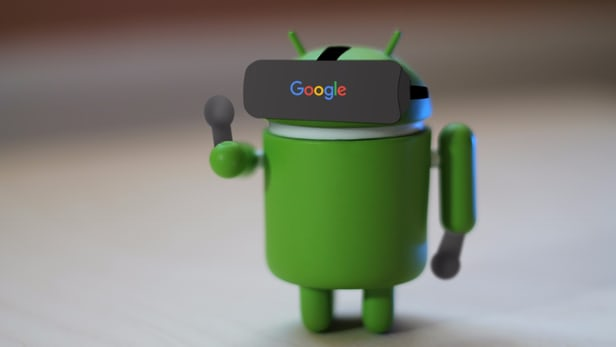

# VR View en Android

## Requisitos

- Es necesario contar con Android Studio versión 2.0 o mayor.
- Tener un teléfono Android versión 5.0 (Lollipop) o mayor.
- Android SDK.
- Android 6.0 (API 23) instalado.
- Contar con la aplicación [Cardboard Camera](https://play.google.com/store/apps/details?id=com.google.vr.cyclops) instalada en su tel[efono.
- Un cable USB para conectar su celular a la computadora.

## Preparación

1. Descomprima haciendo doble click en el folder en el escritorio llamado "vr_view_app_101-master.zip". En caso de no encontrarse en un laboratorio controlado, decarguelo de [Git Hut](https://github.com/googlecodelabs/vr_view_app_101/archive/master.zip) o si sabe cómo, clonelo con el siguiente comando.

    $ git clone https://github.com/googlecodelabs/vr_view_app_101.git
